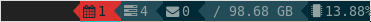

# i3status-custom-pim


`i3status-custom-pim` is a tool to output JSON content for users of the [pimutils](https://github.com/pimutils)

- [khal](https://github.com/pimutils/khal) and
- [todoman](https://github.com/pimutils/todoman).

The output can be used for the custom block of [i3status-rust](https://github.com/greshake/i3status-rust) to display events or due dates in the i3 status bar.

## Requirements
In order to build a binary, you need the Rust language and the package manager `cargo`. And of course you need the pimutils [khal](https://github.com/pimutils/khal) and/or 
[todoman](https://github.com/pimutils/todoman). Please refer to the documentation on the project pages in order to install and configure these tools.

## Install
There are no packaged versions yet, so you have to compile `i3status-cutom-pim` yourself.
```
$ cargo install --git https://github.com/theamma/i3status-custom-pim i3status-custom-pim
```
By default, this will install the binary to `~/.cargo/bin/i3status-custom-pim`. Please make sure, this is in your $PATH or copy the binary to an appropriate location (like `/usr/local/bin`).

You may also compile manually
```
$ git clone https://github.com/theamma/i3status-custom-pim
$ cd i3status-custom-pim && cargo build --release
```

## Configuration
To add the blocks, add this to your i3status-rs configuration 

```
[[block]]
block = "custom"
command = ''' i3status-custom-pim -k '''
json = true

[[block]]
block = "custom"
command = ''' i3status-custom-pim -t -i tasks -w 20160 -c 7200'''
json = true
```

Thresholds for *warning* or *critical* state can be given via commandline switches. In *warning* state the widget will change the background colour to orange, in *critical* state to red.

Please run `i3status-custom-pim --help` for available options.
```
i3status-custom-pim 0.1.0
Martin Bley <dev@mb-oss.de>
Generates JSON output for use with custom block of i3status-rust.

USAGE:
    i3status-custom-pim [FLAGS] [OPTIONS]

FLAGS:
    -h, --help       Prints help information
    -k, --khal       output khal events
    -t, --todo       output todos
    -V, --version    Prints version information

OPTIONS:
    -i, --icon <icon>          the icon used (only names valid in i3status-rust) [default: calendar]
    -c <threshold-crit>        threshold for critical status in minutes [default: 15]
    -w <threshold-warn>        threshold for warning status in minutes [default: 60]
``` 
